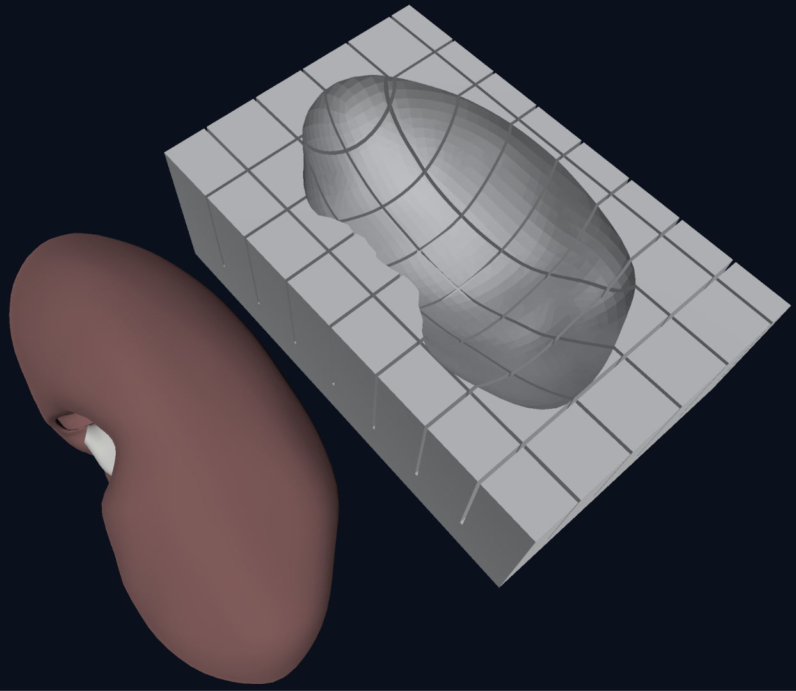

# HRA Millitome

## Table of Contents

- [What is a Millitome?](#what-is-a-millitome)
- [Millitome Catalog](#millitome-catalog)
  - [Kidney](#kidney)
  - [Pancreas](#pancreas)
  - [Spleen](#spleen)

## What is a Millitome?

A millitome (from Latin mille, meaning “thousand,” as in millimeter, and the Greek temnein, meaning "to cut") is a
device designed to hold a freshly procured organ and facilitate cutting it into many small tissue blocks for usage
in single cell analysis. A millitome has discrete equally placed cutting grooves in both the x and y directions to
guide a carbon steel cutting knife to produce standard size slices or cubes of tissue material. Millitomes are
used to create uniformly sized tissue blocks that match the shape and size of organs from the CCF 3D Reference Object
Library.

The procedures outlined here describe how to generate millitomes and how to ensure that spatial locations for each
slice or cube are retained in the Human Reference Atlas.

This page allows you to download complete millitome sets for 3D-printing.
Specific download packages are accessed by selecting the organ (i.e. VH_F_Kidney_L = female kidney, left).
Each organ folder contains three compressed download packages, distinguished by block size (i.e. VH_F_Kidney_L_20
= female kidney, left, 20mm block size).

Each package contains three 3D-printable .STL files, one each for “small”, “medium” and “large” organ sizes to
cover a wide range of variations (i.e. VH_F_Kidney_L_20_Medium = female kidney, left, 20mm block size, medium size).
Also included in each package is a .CSV file to record data about the sample blocks taken from the organ.

## Millitome Catalog

### Kidney

#### Visual Human Female Left Kidney (VH_F_Kidney_L)

* [Millitome Files](https://github.com/hubmapconsortium/hra-millitome/tree/main/millitomes/VH_F_Kidney_L/)

#### Visual Human Female Right Kidney (VH_F_Kidney_R)

* [Millitome Files](https://github.com/hubmapconsortium/hra-millitome/tree/main/millitomes/VH_F_Kidney_R/)

#### Visual Human Male Left Kidney (VH_M_Kidney_L)

* [Millitome Files](https://github.com/hubmapconsortium/hra-millitome/tree/main/millitomes/VH_M_Kidney_L/)

#### Visual Human Male Right Kidney (VH_M_Kidney_R)

* [Millitome Files](https://github.com/hubmapconsortium/hra-millitome/tree/main/millitomes/VH_M_Kidney_R/)

### Pancreas

### Spleen

