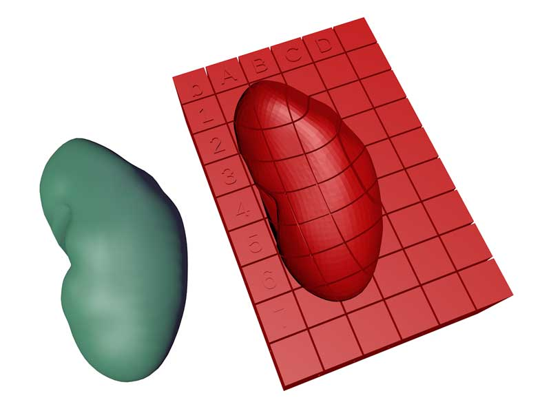

# CCF HRA Millitome

<!--## Table of Contents 

- [What is a Millitome?](#what-is-a-millitome)
- [Millitome Catalog](#millitome-catalog)
  - [Kidney](#kidney)
  - [Pancreas](#pancreas)
  - [Spleen](#spleen)-->

## Overview

A millitome is a device designed to hold a freshly procured organ and facilitate cutting it into many small tissue blocks for usage in single cell analysis. A millitome has discrete equally placed cutting grooves in both the x and y directions to guide a carbon steel cutting knife to produce standard size slices or cubes of tissue material. Millitomes are used to create uniformly sized tissue blocks that match the shape and size of organs from the [CCF 3D Reference Object Library](https://hubmapconsortium.github.io/ccf/pages/ccf-3d-reference-library.html).

This page allows you to download complete millitome sets for 3D-printing.

Specific download packages are accessed by selecting the organ (i.e. VH_F_Kidney_L = female kidney, left).
Each organ folder contains three compressed download packages, distinguished by sample block size (i.e. VH_F_Kidney_L_20
= female kidney, left, 20mm block size).

Each package contains six 3D-printable .STL files for the requested organ, three each for the bottom and top half. Each millitome comes in three size variations to cover a range of organ sizes: large (115%), medium (100%), small (85%). Also included in each package are six matching lookup files in .CSV file format to record data about the sample blocks taken from the organ.

## Millitome Catalog

### Kidney

* [Visual Human Female Left Kidney (VH_F_Kidney_L)](https://github.com/hubmapconsortium/hra-millitome/tree/main/millitomes/VH_F_Kidney_L/)

* [Visual Human Female Right Kidney (VH_F_Kidney_R)](https://github.com/hubmapconsortium/hra-millitome/tree/main/millitomes/VH_F_Kidney_R/)

* [Visual Human Male Left Kidney (VH_M_Kidney_L)](https://github.com/hubmapconsortium/hra-millitome/tree/main/millitomes/VH_M_Kidney_L/)

* [Visual Human Male Right Kidney (VH_M_Kidney_R)](https://github.com/hubmapconsortium/hra-millitome/tree/main/millitomes/VH_M_Kidney_R/)

### Pancreas

* [Visual Human Female Pancreas (VH_F_Pancreas)](https://github.com/hubmapconsortium/hra-millitome/tree/main/millitomes/VH_F_Pancreas/)

* [Visual Human Male Pancreas (VH_M_Pancreas)](https://github.com/hubmapconsortium/hra-millitome/tree/main/millitomes/VH_M_Pancreas/)

### Spleen

* [Visual Human Female Spleen (VH_F_Spleen)](https://github.com/hubmapconsortium/hra-millitome/tree/main/millitomes/VH_F_Spleen/)

* [Visual Human Male Spleen (VH_M_Spleen)](https://github.com/hubmapconsortium/hra-millitome/tree/main/millitomes/VH_M_Spleen/)

<!--

-->
